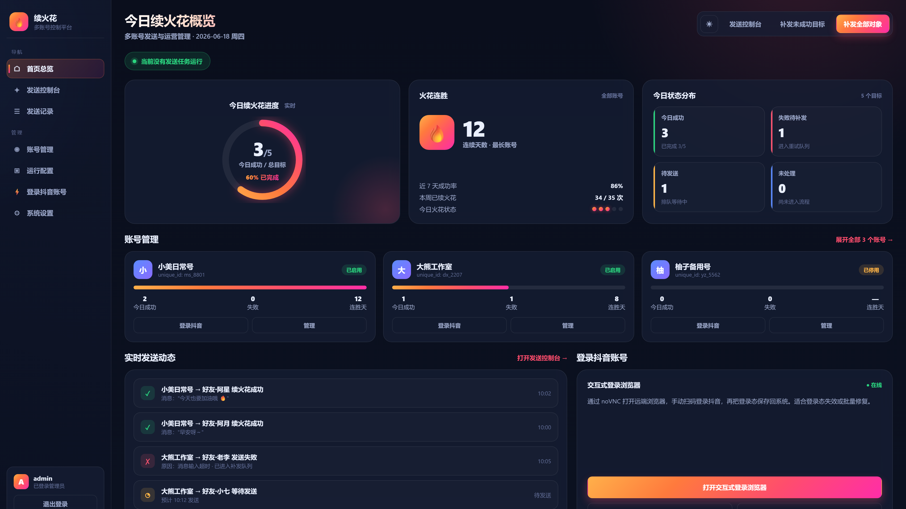
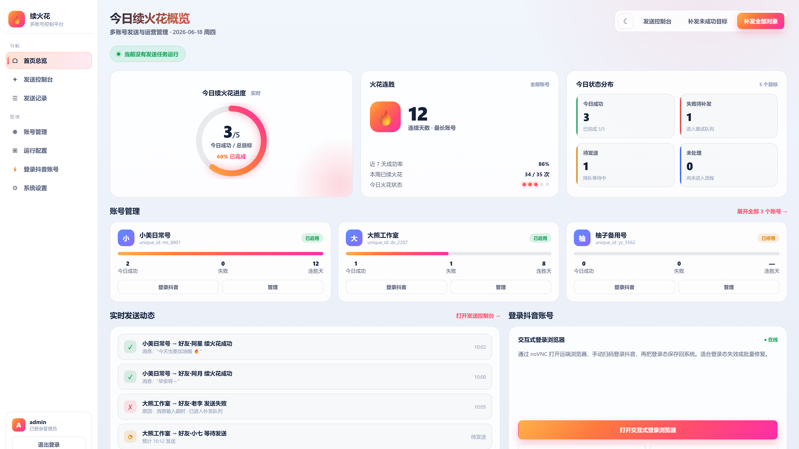

# 🔥 DouYin SparkFlow

<div align="center">

**抖音多账号火花自动维护系统**

一个智能化的抖音好友互动管理工具，自动维护好友火花标记，支持多账号管理、定时发送、Web 控制台

[](https://github.com/halfwaystudent/douyin-sparkflow)
[](LICENSE)
[](https://www.python.org/)
[](https://linux.do)

[功能特性](#-功能特性) • [快速开始](#-快速开始) • [使用文档](#-使用文档) • [部署指南](#-部署指南) • [社区讨论](https://linux.do)

</div>

---

## 📸 主界面预览

### 🌙 暗色模式

<div align="center">
  
  <p><i>Web 管理控制台 - 仪表盘视图（暗色主题）</i></p>
</div>

### ☀️ 亮色模式

<div align="center">
  
  <p><i>Web 管理控制台 - 仪表盘视图（亮色主题）</i></p>
</div>

---

## ✨ 功能特性

### 🎯 核心功能

- **🔄 自动维护火花标记** - 智能识别需要维护的好友关系，自动发送消息保持火花
- **👥 多账号管理** - 支持同时管理多个抖音账号，集中控制、独立配置
- **⏰ 定时任务调度** - 灵活的定时发送策略，支持自定义发送时间窗口
- **🎨 消息模板系统** - 内置多种消息模板（一言、节日祝福等），支持自定义
- **📊 可视化仪表盘** - 实时监控账号状态、任务进度、发送历史

### 🛠️ 技术特性

- **🌐 Web 管理界面** - 现代化的 Web UI，支持移动端访问
- **🎭 主题切换** - 内置亮色/暗色主题，自适应系统偏好
- **🔐 扫码登录** - 安全的二维码登录方式，无需密码
- **🔌 浏览器自动化** - 基于 Playwright 的稳定浏览器控制
- **🐳 容器化部署** - 开箱即用的 Docker 支持，一键部署
- **🔄 登录态持久化** - 自动保存登录状态，减少重复登录
- **📝 完整日志系统** - 详细的操作日志，方便问题追踪

### 🎨 界面特点

- **现代化设计** - 简洁美观的深色模式主界面，炫彩火花渐变效果
- **响应式布局** - 适配桌面和移动设备
- **侧边栏导航** - 清晰的功能分区：概览、登录、账号、控制台、日志、设置
- **实时状态更新** - 账号在线状态、任务执行进度实时显示
- **交互式控制** - 一键启动/停止任务，批量操作支持

---

## 🚀 快速开始

### 前置要求

- Python 3.8 或更高版本
- Docker 和 Docker Compose（用于容器部署）
- 稳定的网络连接

### 📦 安装部署

<details open>
<summary><b>🐳 方式一：Docker 一键部署（推荐）</b></summary>

**适用场景**：服务器部署、生产环境

```bash
# 1. 克隆仓库
git clone https://github.com/halfwaystudent/douyin-sparkflow.git
cd douyin-sparkflow

# 2. 配置环境变量
cp .env.example .env
nano .env  # 根据需要修改配置

# 3. 启动服务
docker-compose up -d

# 4. 访问 Web 界面
# 浏览器打开 http://localhost:8787
```

**服务端口说明**：
- `8787`: Web 管理控制台
- `18090`: 登录桌面 API
- `5901`: VNC 远程桌面
- `8788`: noVNC Web 桌面

</details>

<details>
<summary><b>💻 方式二：本地开发运行</b></summary>

**适用场景**：本地开发、功能测试

```bash
# 1. 克隆仓库
git clone https://github.com/halfwaystudent/douyin-sparkflow.git
cd douyin-sparkflow/DouYinSparkFlow

# 2. 安装依赖
pip install -r requirements.txt
pip install -r requirements-web.txt

# 3. 安装 Playwright 浏览器
playwright install chromium

# 4. 启动 Web 服务
python main.py --web

# 5. 访问 http://localhost:8787
```

</details>

### 🎬 使用流程

1. **登录账号** → 进入"登录工作区"，扫码登录抖音账号
2. **添加好友** → 在"账号管理"中刷新好友列表，选择需要维护火花的好友
3. **配置任务** → 设置发送时间窗口、消息模板
4. **启动任务** → 在"概览"页面启动定时任务
5. **监控运行** → 在"发送控制台"查看实时日志和发送记录

📖 详细使用教程请查看 [使用文档](DouYinSparkFlow/docs/usage.md)

---

## 📂 项目结构

```
douyin-sparkflow/
├── DouYinSparkFlow/          # 核心应用源码
│   ├── core/                 # 核心功能模块
│   │   ├── browser.py        # 浏览器控制
│   │   ├── friends.py        # 好友管理
│   │   ├── login.py          # 登录处理
│   │   ├── msg_builder.py    # 消息构建
│   │   ├── protocol_sender.mjs  # 协议发送
│   │   └── tasks.py          # 任务调度（核心）
│   ├── webui/                # Web 界面
│   │   ├── app.py            # FastAPI 主应用
│   │   ├── auth.py           # 认证模块
│   │   ├── login_sessions.py # 登录会话管理
│   │   ├── ops.py            # 操作接口
│   │   ├── static/           # 静态资源（CSS/JS）
│   │   └── templates/        # HTML 模板
│   ├── utils/                # 工具模块
│   │   ├── config.py         # 配置管理
│   │   ├── logger.py         # 日志记录
│   │   └── hitokoto.py       # 一言 API
│   ├── scripts/              # 辅助脚本
│   ├── docs/                 # 文档和截图
│   ├── main.py               # 主入口
│   ├── login_desktop_server.py  # 登录桌面服务
│   └── relogin_worker.py     # 重登录工作进程
├── proxy/                    # 代理配置
│   └── config.yaml           # Mihomo 代理配置
├── docker-compose.yml        # 容器编排配置
├── .env.example              # 环境变量模板
├── refresh_proxy.sh          # 代理刷新脚本
└── README.md                 # 本文件
```

---

## 📖 使用文档

### 🔑 账号管理

- **扫码登录**：使用抖音 APP 扫描二维码完成登录
- **多账号支持**：可同时管理多个账号，独立配置每个账号的发送策略
- **登录态保持**：自动保存登录状态，无需频繁重新登录
- **状态监控**：实时显示账号在线状态和登录有效期

### 📝 消息管理

**内置模板类型**：
- **一言（Hitokoto）**：随机诗词、名言警句
- **节日祝福**：自动识别节假日，发送对应祝福语
- **自定义消息**：支持纯文本自定义消息

**发送策略**：
- 时间窗口设置（如：09:00-22:00）
- 随机延迟避免检测
- 发送失败自动重试
- 发送确认机制

### ⚙️ 配置说明

<details>
<summary>点击查看配置文件说明</summary>

#### `.env` - 环境变量配置

```bash
# 代理配置（可选）
PROXY_URL=http://proxy-container:7890

# Web 服务端口
WEB_PORT=8787

# 登录桌面端口
LOGIN_DESKTOP_PORT=18090

# VNC 端口
VNC_PORT=5901
```

#### `config.json` - 应用配置

```json
{
  "send_window_start": "09:00",  // 发送窗口开始时间
  "send_window_end": "22:00",    // 发送窗口结束时间
  "send_interval_min": 300,      // 最小发送间隔（秒）
  "message_template": "hitokoto", // 消息模板类型
  "enable_send_confirm": true,   // 启用发送确认
  "friend_refresh_interval": 3600 // 好友列表刷新间隔（秒）
}
```

</details>

---

## 🐳 部署指南

### Docker Compose 部署（推荐）

本项目提供完整的 Docker Compose 配置，包含以下服务：

- **douyin-web**: Web 管理控制台服务
- **login-desktop**: 登录桌面服务（包含浏览器环境）
- **proxy**: Mihomo 代理服务（可选）

#### 快速部署

```bash
# 1. 准备环境变量
cp .env.example .env

# 2. 启动所有服务
docker-compose up -d

# 3. 查看日志
docker-compose logs -f

# 4. 停止服务
docker-compose down
```

#### 仅部署 Web 服务

```bash
docker-compose up -d douyin-web
```

### 服务器部署最佳实践

<details>
<summary>查看部署建议</summary>

#### 系统要求

- **CPU**: 2 核心或以上
- **内存**: 2GB 或以上
- **存储**: 10GB 可用空间
- **系统**: Ubuntu 20.04+ / CentOS 7+ / Debian 10+

#### 持久化数据

以下目录建议挂载为数据卷：

```yaml
volumes:
  - ./state:/app/state          # 运行状态数据
  - ./logs:/app/logs            # 日志文件
  - ./DouYinSparkFlow:/app      # 应用代码（开发环境）
```

#### 网络配置

如需外网访问，建议配置反向代理（Nginx/Caddy）：

```nginx
# Nginx 配置示例
server {
    listen 80;
    server_name sparkflow.example.com;
    
    location / {
        proxy_pass http://localhost:8787;
        proxy_set_header Host $host;
        proxy_set_header X-Real-IP $remote_addr;
    }
}
```

#### 安全建议

- ✅ 修改默认管理员密码
- ✅ 启用 HTTPS（使用 Let's Encrypt）
- ✅ 配置防火墙规则
- ✅ 定期备份 `state/` 和 `usersData.json`
- ✅ 使用环境变量管理敏感配置

</details>

---

## 🔧 高级配置

### 代理配置

项目支持通过代理访问抖音服务，配置文件位于 `proxy/config.yaml`：

```yaml
mixed-port: 7890
allow-lan: true
mode: rule
# ... 更多配置见配置文件
```

### GitHub Actions 定时任务

支持通过 GitHub Actions 运行定时任务，配置文件：`.github/workflows/schedule.yml`

---

## 📊 技术栈

- **后端框架**: FastAPI - 现代化的 Python Web 框架
- **前端**: HTML5 + CSS3 + Vanilla JavaScript
- **浏览器自动化**: Playwright - 跨浏览器自动化
- **容器化**: Docker + Docker Compose
- **代理**: Mihomo (Clash Meta)
- **任务调度**: APScheduler
- **模板引擎**: Jinja2

---

## ⚠️ 免责声明

> **本项目仅供学习研究使用**

- 本工具仅用于技术学习和个人使用，不得用于任何商业用途
- 使用本工具产生的一切后果由使用者自行承担
- 请遵守平台规则，合理使用，避免频繁操作
- 作者不对使用本工具导致的账号异常、封禁等问题负责
- 请评估使用风险，建议使用小号测试

---

## 📝 更新日志

查看 [CHANGELOG.md](DouYinSparkFlow/CHANGELOG.md) 了解版本更新历史。

**最新更新** (2026-05-30):
- ✨ 重新设计 Web UI，全新视觉风格
- 🎨 新增亮色/暗色主题切换
- 📱 优化移动端响应式布局
- 🔄 改进好友列表刷新可靠性
- 🚀 优化一键部署流程
- 📖 新增截图使用指南

---

## 🤝 贡献

欢迎提交 Issue 和 Pull Request！

1. Fork 本仓库
2. 创建特性分支 (`git checkout -b feature/AmazingFeature`)
3. 提交更改 (`git commit -m 'Add some AmazingFeature'`)
4. 推送到分支 (`git push origin feature/AmazingFeature`)
5. 开启 Pull Request

---

## 📄 许可证

本项目采用 [MIT License](DouYinSparkFlow/LICENSE) 开源协议。

---

## 🌟 Star History

[](https://star-history.com/#halfwaystudent/douyin-sparkflow&Date)

---

## 🔗 相关链接

- **项目主页**: [GitHub Repository](https://github.com/halfwaystudent/douyin-sparkflow)
- **社区讨论**: [Linux Do 社区](https://linux.do)
- **使用文档**: [docs/usage.md](DouYinSparkFlow/docs/usage.md)
- **问题反馈**: [Issues](https://github.com/halfwaystudent/douyin-sparkflow/issues)

---

<div align="center">

**如果这个项目对你有帮助，请给个 ⭐ Star 支持一下！**

Made with ❤️ by [halfwaystudent](https://github.com/halfwaystudent)

</div>
